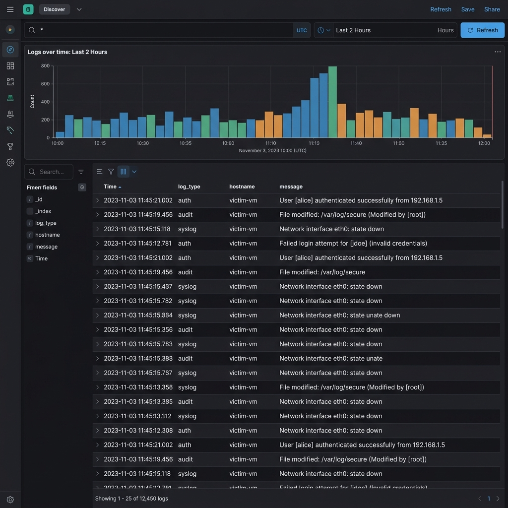
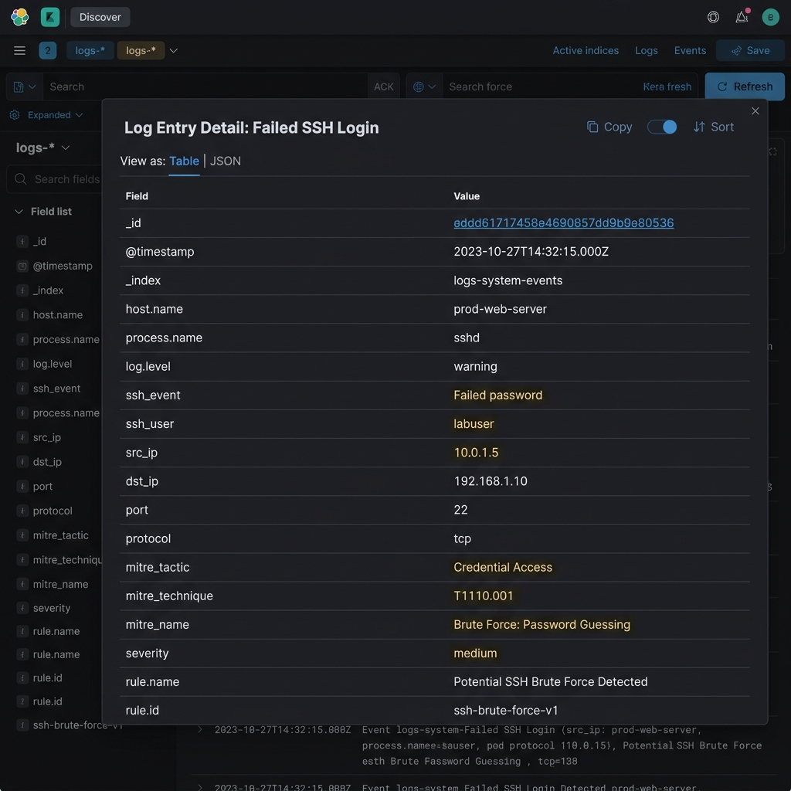

# ThreatLens: End-to-End SOC Detection & Threat Hunting Lab
## Comprehensive Technical Documentation & User Manual

Welcome to the comprehensive documentation suite for **ThreatLens**, a customized, cloud-native Security Operations Center (SOC) detection, threat hunting, and attack simulation lab environment deployed on Microsoft Azure.

> NOTE: This repository now includes more secure deployment guidance for real-life use. Remove or sanitize any real credentials before publishing to GitHub, and use Azure Key Vault for secrets.

This document is divided into two primary sections:
1. **📄 Technical Documentation** (for developers, DevOps engineers, and security analysts)
2. **📘 User Manual** (for end-users, lab students, and junior SOC operators)

---

# Part 1: 📄 Technical Documentation

## 1. Project Overview & Purpose

**ThreatLens** is an isolated, cloud-based cyber range designed for threat simulation, log correlation, security monitoring, and detection engineering. By hosting a dedicated attacker node, a vulnerable target host, and a modern SIEM (Security Information and Event Management) system, the project serves as a practical environment to:
- Simulate real-world adversarial techniques (based on the **MITRE ATT&CK** matrix).
- Capture and ship host, network, and application-level telemetry.
- Correlate events using Logstash filters and index them in Elasticsearch.
- Develop custom detection rules, alerts, and dashboards in Kibana.
- Verify security isolation boundaries in cloud infrastructure.

The ultimate goal of ThreatLens is to bridge the gap between offensive operations (Red Teaming) and defensive operations (Blue Teaming), forming a robust platform for detection engineering.

---

## 2. Architecture & Tech Stack

The lab is deployed on Microsoft Azure using virtual network isolation and custom security groups.

```mermaid
graph TD
    subgraph Azure Virtual Network (10.0.0.0/16)
        subgraph Attacker Subnet (10.0.1.0/24)
            AttackerVM[attacker-vm <br> 10.0.1.5]
        end
        
        subgraph Victim Subnet (10.0.0.0/24)
            VictimVM[victim-vm <br> 10.0.0.4]
            Filebeat[Filebeat Agent]
            Auditbeat[Auditbeat Agent]
        end
        
        subgraph SIEM Subnet (10.0.3.0/24)
            SIEM[elk-siem <br> 10.0.3.4]
            Elasticsearch[(Elasticsearch)]
            Logstash[Logstash Pipeline]
            Kibana[Kibana Web UI]
        end
    end
    
    %% Attack Flow
    AttackerVM -->|Attacks: SSH, DVWA, vsftpd| VictimVM
    
    %% Log Shipping
    Filebeat -->|Logs on port 5044| Logstash
    Auditbeat -->|Audit events on port 5044| Logstash
    
    %% Internal SIEM
    Logstash -->|Ingests on localhost:9200| Elasticsearch
    Kibana -->|Queries localhost:9200| Elasticsearch
    
    %% User Access
    User([Security Analyst]) -->|SSH Local Port Forwarding| SIEM
    User -->|Web Access to localhost:5601| Kibana
```

> Secure access note: VMs are deployed without public IP addresses. Use Azure Bastion or a VPN to connect to the lab.

### Virtual Machine Configurations

To respect core quotas (6 cores limit on student accounts) and optimize performance, the system family allocations are:

1. **`attacker-vm`**
   - **Instance Size:** `Standard_D2s_v3` (2 Cores, 8 GB RAM)
   - **OS:** Ubuntu 22.04 LTS
   - **Subnet:** `attacker-subnet` (`10.0.1.0/24`)

2. **`victim-vm`**
   - **Instance Size:** `Standard_D2s_v3` (2 Cores, 8 GB RAM)
   - **OS:** Ubuntu 22.04 LTS
   - **Subnet:** `victim-subnet` (`10.0.0.0/24`)

3. **`elk-siem`**
   - **Instance Size:** `Standard_D4s_v3` (4 Cores, 16 GB RAM)
   - **OS:** Ubuntu 22.04 LTS
   - **Subnet:** `siem-subnet` (`10.0.3.0/24`)

### Ingestion & Security Boundary Protocols
- **Network Security Groups (NSGs):** 
  - The `attacker-nsg` blocks outbound traffic to the `siem-subnet` (`10.0.3.0/24`) to simulate network segmentation and prevent attackers from tampering with the SIEM.
  - The `victim-nsg` allows inbound traffic from the `attacker-subnet` (`10.0.1.0/24`) for simulation, and allows outbound Beats shipping to the SIEM (`10.0.3.4:5044`).
  - The `siem-nsg` restricts port `5044` (Beats) to the `victim-subnet` and limits management ports (`22`, `5601`) to the administrator's public IP.

---

## 3. Folder/File Structure

The local workspace is organized as follows:

```
ThreatLens/
├── credentials.txt         # Local credential template only. Do not commit real secrets.
├── task.md                 # Project checklist and deployment tasks tracking
├── docs/
│   ├── phase2_lab_setup.md # Manual installation guides and commands
│   └── threatlens_comprehensive_docs.md  # [This Document] Full documentation & manual
└── scripts/
    ├── deploy_infra.ps1    # PowerShell script to deploy VNet, Subnets, and NSGs
    └── deploy_vms.ps1      # PowerShell script to provision Azure VMs and shutdown policies
```

---

## 4. Installation & Setup Guide

### 4.1. Azure Infrastructure Deployment
Deploy the infrastructure components using Azure CLI or PowerShell from your administrator workstation:
```powershell
# Step 1: Deploy network resources
.\scripts\deploy_infra.ps1

# Step 2: Deploy Attacker, Victim, and SIEM VMs
.\scripts\deploy_vms.ps1
```

### 4.2. ELK SIEM Configuration (`elk-siem`)
1. SSH into the SIEM VM:
   ```bash
   ssh elkadmin@<siem-public-ip> -i ~/.ssh/id_rsa
   ```
2. Set up the Elastic Apt repository and install the stack:
   ```bash
   sudo apt update && sudo apt install -y elasticsearch logstash kibana
   ```
3. Configure the heap sizes for Elasticsearch (`/etc/elasticsearch/jvm.options.d/heap.options` -> `-Xms4g`, `-Xmx4g`) and Logstash (`/etc/logstash/jvm.options.d/heap.options` -> `-Xms512m`, `-Xmx1g`).
4. Apply the Elasticsearch configuration (`/etc/elasticsearch/elasticsearch.yml`) and start the service:
   ```bash
   sudo systemctl enable --now elasticsearch
   sudo /usr/share/elasticsearch/bin/elasticsearch-setup-passwords auto
   ```
5. Apply the Kibana configuration (`/etc/kibana/kibana.yml`) and start the service:
   ```bash
   sudo systemctl enable --now kibana
   ```

### 4.3. Victim Configuration (`victim-vm`)
1. SSH into the victim VM:
   ```bash
   ssh victim@<victim-public-ip> -i ~/.ssh/id_rsa
   ```
2. Install vulnerable services:
   - Configure a dummy account (`labuser:password123`) and enable password authentication in `/etc/ssh/sshd_config.d/` and `/etc/ssh/sshd_config`.
   - Install Apache, PHP, MySQL, vsftpd, and clone the **Damn Vulnerable Web Application (DVWA)** into `/var/www/html/dvwa`.
   - **Warning:** This setup is only for training and should not be used in a real production SOC.
3. Set up auditing rules in `/etc/audit/rules.d/threatlens.rules` to monitor system execution, netcat spawns, and credential file reads, then reload:
   ```bash
   sudo augenrules --load
   ```
4. Install Filebeat and Auditbeat, and set their outputs to point to Logstash at `10.0.3.4:5044`.

### 4.4. Attacker Configuration (`attacker-vm`)
1. SSH into the attacker VM:
   ```bash
   ssh attacker@<attacker-public-ip> -i ~/.ssh/id_rsa
   ```
2. Install security testing utilities:
   ```bash
   sudo apt update && sudo apt install -y nmap hydra netcat-openbsd sqlmap gobuster curl python3-pip git
   curl https://raw.githubusercontent.com/rapid7/metasploit-omnibus/master/config/templates/metasploit-framework-wrappers/msfupdate.erb > msfinstall
   chmod 755 msfinstall && sudo ./msfinstall
   ```

---

## 5. Environment Variables & Configuration

### 5.1. Logstash Pipeline Config (`/etc/logstash/conf.d/threatlens.conf`)
The pipeline processes events on port `5044` and routes them using the `log_type` field:
```ruby
input {
  beats {
    port => 5044
    type => "beats"
  }
}

filter {
  # Regex-based extraction of auth logs
  if [log][file][path] =~ /auth\.log/ {
    grok {
      match => {
        "message" => [
          "%{SYSLOGTIMESTAMP:timestamp} %{HOSTNAME:hostname} sshd\[%{POSINT:pid}\]: %{DATA:ssh_event} for %{DATA:ssh_user} from %{IP:src_ip} port %{NUMBER:src_port}",
          "%{SYSLOGTIMESTAMP:timestamp} %{HOSTNAME:hostname} sshd\[%{POSINT:pid}\]: %{DATA:ssh_event} password for %{DATA:ssh_user} from %{IP:src_ip}"
        ]
      }
    }
    mutate { remove_field => [ "log_type" ] }
    mutate { add_field => { "log_type" => "auth" } }
  }

  # Grok parse apache access logs
  if [log][file][path] =~ /apache/ {
    grok { match => { "message" => '%{COMBINEDAPACHELOG}' } }
    mutate {
      convert => { "response" => "integer" }
      convert => { "bytes" => "integer" }
      remove_field => [ "log_type" ]
    }
    mutate { add_field => { "log_type" => "apache" } }
    if [response] == 403 or [response] == 500 {
      mutate { add_tag => ["suspicious_http"] }
    }
  }

  # Process auditd logs
  if [log][file][path] =~ /audit/ {
    grok {
      match => {
        "message" => "type=%{WORD:audit_type} msg=audit\(%{NUMBER:audit_epoch}:%{NUMBER:audit_seq}\): %{GREEDYDATA:audit_data}"
      }
    }
    mutate { remove_field => [ "log_type" ] }
    mutate { add_field => { "log_type" => "audit" } }
  }

  # GeoIP and MITREATT&CK tagging
  if [src_ip] {
    geoip { source => "src_ip" target => "geoip" }
  }
  if [ssh_event] =~ "Failed" {
    mutate {
      add_field => {
        "mitre_tactic"    => "Credential Access"
        "mitre_technique" => "T1110.001"
        "mitre_name"      => "Brute Force: Password Guessing"
        "severity"        => "medium"
      }
    }
  }

  # Fallback logic for log_type
  if ![log_type] {
    if [agent][type] == "auditbeat" {
      mutate { add_field => { "log_type" => "audit" } }
    } else {
      mutate { add_field => { "log_type" => "other" } }
    }
  }
}

output {
  elasticsearch {
    hosts => ["http://localhost:9200"]
    user => "elastic"
    password => "YOUR_GENERATED_PASSWORD"
    index => "logs-%{[log_type]}-%{+YYYY.MM.dd}"
    action => "create" # Crucial for 8.x logs-* data streams support
  }
}
```

---

## 6. API Reference (Elasticsearch REST API)

Developers can query telemetry data directly via the Elasticsearch REST API.

### 6.1. Retrieve Cluster Health
- **Endpoint:** `GET /_cluster/health`
- **Authentication:** Basic Auth (`elastic:password`)
- **Headers:** `Content-Type: application/json`
- **Response Example:**
  ```json
  {
    "cluster_name" : "threatlens-siem",
    "status" : "yellow",
    "number_of_nodes" : 1,
    "active_primary_shards" : 12,
    "unassigned_shards" : 8
  }
  ```

### 6.2. Query Brute Force Authentication Logs
- **Endpoint:** `GET /logs-auth-*/_search`
- **Authentication:** Basic Auth (`elastic:password`)
- **Request Parameters:**
  - `q=ssh_event:Failed`
- **Response Example:**
  ```json
  {
    "hits" : {
      "total" : { "value" : 3, "relation" : "eq" },
      "hits" : [
        {
          "_index" : ".ds-logs-auth-2026.06.03-000001",
          "_source" : {
            "message" : "Jun 3 16:56:54 victim-vm sshd[16364]: Failed password for invalid user invaliduser from 127.0.0.1 port 41654 ssh2",
            "log_type" : "auth",
            "ssh_event" : "Failed password",
            "mitre_tactic" : "Credential Access",
            "mitre_technique" : "T1110.001",
            "severity" : "medium"
          }
        }
      ]
    }
  }
  ```

---

## 7. Elasticsearch Schema & Mappings

The data streams utilize standard mapping definitions. Below is a subset schema of the `logs-auth-*` data stream:

| Field Name | Type | Description |
| :--- | :--- | :--- |
| `@timestamp` | `date` | Timestamp when the event was recorded. |
| `message` | `text` | Raw log message from SSH daemon or shell. |
| `log_type` | `keyword` | Document classifier: `auth`, `audit`, `apache`, `syslog`, or `other`. |
| `ssh_event` | `keyword` | Classified event action (e.g., `Failed password`, `Accepted publickey`). |
| `ssh_user` | `keyword` | Username attempted during authentication. |
| `src_ip` | `ip` | Source IP address initiating the connection. |
| `src_port` | `integer` | Source port of the connecting client. |
| `mitre_tactic` | `keyword` | Associated MITRE Tactic (e.g. `Credential Access`). |
| `mitre_technique` | `keyword` | Associated MITRE Technique ID (e.g. `T1110.001`). |
| `severity` | `keyword` | Calculated risk indicator: `low`, `medium`, `high`. |

---

## 8. Third-party Integrations

### 8.1. MITRE ATT&CK Mapping
ThreatLens integrates mapping tags within the Logstash filtering step. If rules match indicators of compromise (IOCs), the platform enriches the record with taxonomy tags.
- **Tactic:** Credential Access
- **Technique:** Brute Force: Password Guessing (T1110.001)

### 8.2. MaxMind GeoIP Database
Logstash integrates a free MaxMind GeoIP lookup filter. When an external public IP address hits one of the monitored services, Logstash looks up the IP location in `/var/lib/logstash/geoip_database_management` and injects:
- `geoip.geo.country_iso_code` (e.g. `IN`)
- `geoip.geo.city_name` (e.g. `Jaipur`)
- `geoip.geo.location` (Latitude and Longitude for map visualization)

---

## 9. Error Handling & Troubleshooting

Here are common technical challenges encountered during deployment and how they are resolved:

### 9.1. Elasticsearch Log Directory Permission Error (78)
- **Symptom:** Elasticsearch service crashes instantly with code `78`.
- **Cause:** Defaults to write to `/usr/share/elasticsearch` which is read-only or permission-restricted.
- **Fix:** Update `/etc/elasticsearch/elasticsearch.yml` to write to default system directories:
  ```yaml
  path.data: /var/lib/elasticsearch
  path.logs: /var/log/elasticsearch
  ```

### 9.2. Data Stream Index Op Type Rejections (400)
- **Symptom:** Logstash fails to index records into Elasticsearch and outputs error `only write ops with an op_type of create are allowed in data streams`.
- **Cause:** Elasticsearch 8.x forces all `logs-*` index names to behave as write-once data streams. Logstash uses `action => "index"` by default, which is blocked.
- **Fix:** Update the Elasticsearch output block in Logstash configuration to set `action => "create"`.

---

## 10. Deployment Guide

Follow this standard SOP to deploy ThreatLens into a new environment:
1. **Quota Checks:** Ensure your target subscription has at least 8 available regional cores and 3 available Public IPs.
2. **Infrastructure Run:** Run `deploy_infra.ps1` from a workstation logged into the Azure CLI.
3. **VM Provisioning:** Run `deploy_vms.ps1` to deploy VMs in a compatible region (e.g. `southeastasia`).
4. **Services Installation:** Apply installation shell scripts (`setup_elk.sh`, `setup_victim.sh`, `setup_attacker.sh`) to the respective hosts.
5. **Autoshutdown:** Confirm that auto-shutdown is configured to run at `23:00` daily to control cloud compute costs.

---

# Part 2: 📘 User Manual

## 1. Introduction & What the App Does

**ThreatLens** is a fully functional cyber-security simulation lab. As a user, this system provides you with three connected consoles to explore both the offensive and defensive sides of cybersecurity:
1. **The Attacker VM:** A virtual Linux environment loaded with testing tools. You will use this node to perform simulated attacks (e.g. port scans, password guessing attacks) against the target.
2. **The Victim VM:** A simulated target system hosting typical web and network applications (including an FTP server and a vulnerable website).
3. **The ELK SIEM Console:** A powerful central management system that captures every event on the victim machine and presents it to you on interactive screens.

Use this environment to safely practice network hacking, study system logs, and learn how security analysts detect and block active intrusions.

---

## 2. Getting Started

### 2.1. Accessing the SIEM Console (Kibana)
Access to the SIEM console is secured using SSH tunneling. To open it:
1. Open a PowerShell terminal on your Windows host.
2. Establish the secure connection tunnel by entering:
   ```powershell
   ssh -L 5601:localhost:5601 -i C:\Users\<YOUR_USER>\.ssh\id_rsa elkadmin@<SIEM_PUBLIC_IP>
   ```
   *(Keep this terminal window open; closing it shuts down the link).*
3. Open your web browser and go to: **[http://localhost:5601](http://localhost:5601)**
4. Sign in with the credentials:
   - **Username:** `elastic`
   - **Password:** `<ELASTIC_PASSWORD>`

---

## 3. Step-by-step Feature Guide

### 3.1. Creating a Data View
Before exploring logs, you must tell Kibana which logs to load:
1. Click the **Hamburger Menu** (top-left) and select **Stack Management** (bottom).
2. Click **Data Views** -> **Create data view** (blue button).
3. Fill in the parameters:
   - **Name:** `logs-*`
   - **Index pattern:** `logs-*`
   - **Timestamp field:** Select `@timestamp`.
4. Click **Save data view to Kibana**.

### 3.2. Monitoring SSH Brute Force Attacks
To see attacks executed from your attacker machine:
1. Go to the Hamburger Menu and click **Analytics** -> **Discover**.
2. Select your `logs-*` data view.
3. In the search bar, type: `invaliduser` and click **Refresh** or hit Enter.
4. You will see a list of failed login attempts. Expand any log entry to view the source IP, target user, and mapped MITRE attack tags!

---

## 4. Screenshot Placeholders

*When creating reports, use these screenshots as visual aids:*

## 4. Operational Screenshots

Use these screenshots to guide your interface validation:

### 📸 Screenshot 1: Discover Log Dashboard
- **Location:** Navigate to **Analytics** -> **Discover**
- **Description:** This screen displays the timeline bar chart of incoming logs. Below the chart, individual documents from Filebeat and Auditbeat are shown. The `log_type` column highlights logs categorized as `auth`, `audit`, or `syslog`.


### 📸 Screenshot 2: Failed Login Event Expansion
- **Location:** Within **Discover**, search for `labuser` and expand a row.
- **Description:** This displays the parsed JSON fields showing `"ssh_event": "Failed password"`, the source IP `"src_ip": "10.0.1.5"`, and the security tags `"mitre_tactic": "Credential Access"`, `"mitre_technique": "T1110.001"`, and `"mitre_name": "Brute Force: Password Guessing"`.


---

## 5. FAQs

### Q: Why do I see a "This site can't be reached" error when opening Kibana?
**A:** The secure SSH tunnel is not running. Re-run the `ssh -L 5601:localhost...` command in your terminal and ensure the connection stays active.

### Q: Are the VM systems safe from outside hackers?
**A:** Yes. The Network Security Groups (firewalls) are configured to block all incoming traffic except from your specific public IP address.

### Q: Will I be charged for running these VMs indefinitely?
**A:** To save your Azure credits, all virtual machines are configured to shut down automatically at **23:00 (11:00 PM) daily**. If you are studying outside this window, you must manually start the VMs in the Azure Portal.

---

## 6. Common Errors & How to Fix Them

### 6.1. Filebeat Output Connection Failures
- **Error message in syslog:** `Failed to publish events... connection reset by peer` or `connection refused`.
- **Cause:** The Logstash service on the SIEM VM is stopped or restarting.
- **Fix:** SSH into the SIEM VM and run `sudo systemctl restart logstash`. Wait 15 seconds and verify that the port is listening by running `sudo ss -tulpn | grep 5044`.

### 6.2. Missing MITRE ATT&CK Enrichment
- **Symptom:** Failed logins appear under `logs-syslog` instead of `logs-auth` and lack MITRE tags.
- **Cause:** Logstash failed to match the log path due to path variables or grok mismatch.
- **Fix:** Verify that the Logstash configuration file uses correct regex literals `/auth\.log/` instead of string matching `"auth.log"`.

---

## 7. Glossary of Terms

- **SIEM (Security Information & Event Management):** A software platform that aggregates and analyzes activity from different resources across your entire IT infrastructure.
- **Grok:** A Logstash filter plugin that parses unstructured log messages into structured, searchable fields using regular expressions.
- **Auditd:** The Linux Audit Daemon, a system that tracks security-relevant events, system calls, and file modifications on a Linux kernel level.
- **Beats (Filebeat/Auditbeat):** Lightweight data shippers installed on target hosts to collect and forward logs to Logstash or Elasticsearch.
- **SSH Tunneling:** A method of transporting arbitrary networking data over an encrypted SSH connection, used here to securely expose Kibana over the internet.

---

# Part 3: ⚔️ Attack Simulation & Detection Engineering Guide

This section is a walkthrough of typical attack scenarios executed in the lab, including the exact commands used and the corresponding detection rules you can observe in Kibana.

## 1. Scenario A: Host & Service Discovery (Reconnaissance)
Adversaries search systems to locate services running within the network target.

### 1.1. Execution Command (Attacker VM)
```bash
nmap -sV -F 10.0.0.4
```

### 1.2. Telemetry and Detection (SIEM Console)
- **Log Stream:** `logs-apache-*`
- **Fields to Search:** `url.original: "nmaplowercheck*"` or `user_agent.original: "*Nmap*"`
- **Detection Logic:** A spike in HTTP requests returning `404` status codes originating from the attacker subnet (`10.0.1.0/24`) with an user-agent string referencing the Nmap Scripting Engine.

---

## 2. Scenario B: SSH Brute Force (Credential Access)
Adversaries attempt to log in using multiple passwords to gain credentials.

### 2.1. Execution Command (Attacker VM)
```bash
# Create custom passwords list
echo -e 'admin\npassword\n123456\nqwerty\npassword123' > passwords.txt
# Run Hydra brute-force
hydra -l labuser -P passwords.txt ssh://10.0.0.4
```

### 2.2. Telemetry and Detection (SIEM Console)
- **Log Stream:** `logs-auth-*`
- **Fields to Search:** `ssh_user: "labuser"`, `ssh_event: "Failed password"`, `src_ip: "10.0.1.5"`
- **MITRE Mappings:**
  - Tactic: **Credential Access**
  - Technique: **Brute Force: Password Guessing (T1110.001)**
- **Detection Logic:** Multiple SSH authentication failure events (`ssh_event: "Failed password"`) from a single IP source within a very short timeframe (e.g. 5+ attempts in 10 seconds), followed by a single successful authentication event (`ssh_event: "Accepted password"`).

---

## 3. Scenario C: Sensitive File Access & Command Audit (Collection / Privilege Escalation)
Adversaries attempt to read sensitive system configuration databases and system logs.

### 3.1. Execution Command (Victim VM - Interactive Shell)
```bash
# Attempt to read shadow password file
sudo cat /etc/shadow
```

### 3.2. Telemetry and Detection (SIEM Console)
- **Log Stream:** `logs-audit-*`
- **Fields to Search:** `process.args: "cat"` and `process.args: "/etc/shadow"`, or `process.executable: "/usr/bin/sudo"`
- **Detection Logic:** Correlation of execution processes in Auditbeat/Auditd telemetry tracking root user commands that read sensitive paths (`/etc/shadow`, `/etc/sudoers`) or trigger rules defined in the host's `/etc/audit/rules.d/threatlens.rules` rule base.
